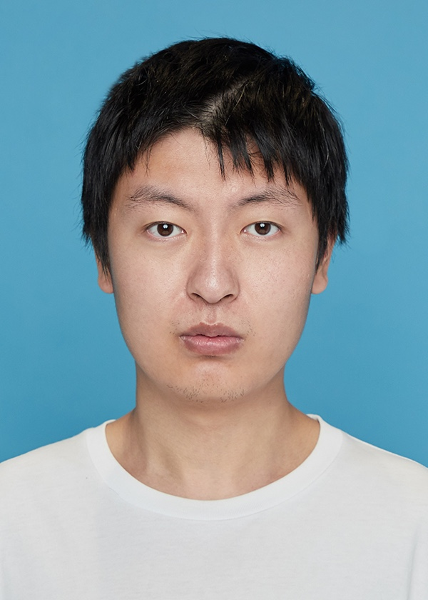
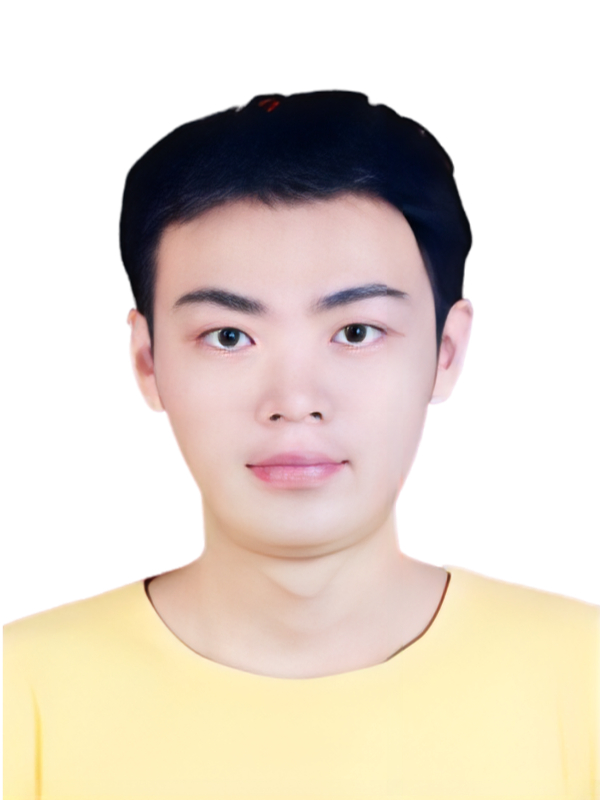
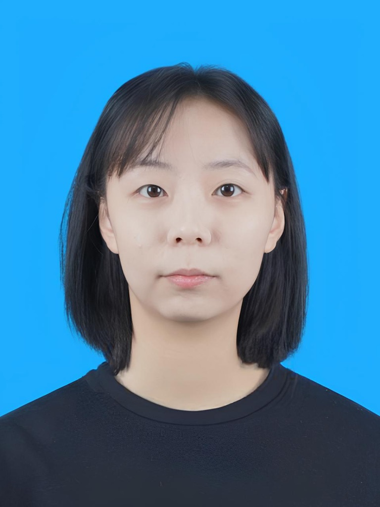
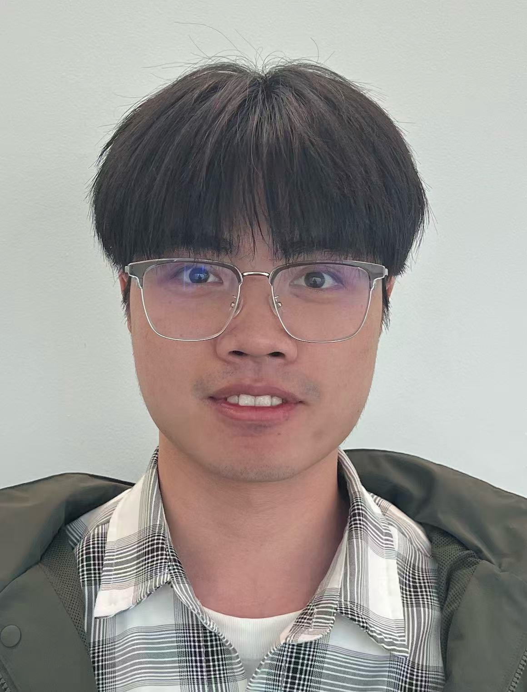
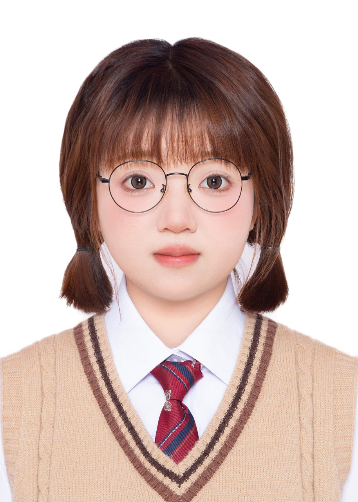

<!-- 

    <h1>Members</h1>
    

        <button onclick="switchLang('en')" id="btn-en">English</button>
        <button onclick="switchLang('zh')" id="btn-zh">中文</button>
    

 -->

## **Principal Investigator**

    

        

            
        

        

            
<a href="https://www.eitech.edu.cn/2025/0721/c287a707/page.htm" target="_blank">Wenjun Zeng曾文军</a>

            
Lab Director, IEEE Fellow, Fellow of CAE实验室主任

            
Computer Vision, Multimedia, Embodied AI, Spatial Intelligence

            
Mail: <a href="mailto:wzeng-vp@eitech.edu.cn">wzeng-vp@eitech.edu.cn</a>

        

    

## **Faculties**

    

        

            
        

        

            
<a href="https://jinx-ustc.github.io/jinxin.github.io/" target="_blank">Xin Jin金鑫</a>

            
Assistant Professor助理教授

            
Computer Vision, Multimedia, Embodied AI, Spatial Intelligence

            
Mail: <a href="mailto:jinxin@eitech.edu.cn">jinxin@eitech.edu.cn</a>

        

    

## **Researchers**

    

        

            
        

        

            
Shengyang Zhao赵盛洋

            
Associate Researcher (affiliated with IDT)副研究员

            
Multimedia, Coding & Quality Assessment, Spatial Intelligence and Autonomous Driving

            
Mail: <a href="mailto:szhao@idt.eitech.edu.cn">szhao@idt.eitech.edu.cn</a>

        

    

    

        

            
        

        

            
Xiangyu Li李翔宇

            
Associate Researcher (affiliated with IDT)副研究员

            
Mail: <a href="mailto:xli@idt.eitech.edu.cn">xli@idt.eitech.edu.cn</a>

        

    

    

        

            
        

        

            
Baao Xie谢巴奥

            
Associate Researcher (affiliated with IDT)副研究员

            
Computer Vision, 3D Reconstruction, Disentangled Representation Learning, Multimodal Large Models

            
Mail: <a href="mailto:bxie@idt.eitech.edu.cn">bxie@idt.eitech.edu.cn</a>

        

    

    

        

            
        

        

            
<a href="https://hhwu18.github.io" target="_blank">Huihui Wu吴辉辉</a>

            
Associate Researcher (affiliated with IDT)副研究员

            
Mail: <a href="mailto:hhwu@idt.eitech.edu.cn">hhwu@idt.eitech.edu.cn</a>

        

    

    

        

            
        

        

            
Shaoyang Hua滑少扬

            
Postdoctoral Researcher (affiliated with EIT)博士后研究员

            
Brain-Computer Interface, AI-Generated Content (AIGC), Embodied AI

            
Mail: <a href="mailto:syhua@eitech.edu.cn">syhua@eitech.edu.cn</a>

        

    

    

        

            
        

        

            
Hao Zheng郑豪

            
Postdoctoral Researcher (affiliated with EIT)博士后研究员

            
Disentangled Representation Learning, Reinforcement Learning, Operations and Supply Chain Management, Marketing Analytics

            
Mail: <a href="mailto:hzheng@eitech.edu.cn">hzheng@eitech.edu.cn</a>

        

    

## **Students**

### Since 2022

    

        

            
        

        

            
<a href="https://liangxuy.github.io/" target="_blank">Liang Xu徐良</a>

            
Ph.D. Student (SJTU)博士生（上海交通大学）

            
Human, Avatar, Robots

            
Mail: <a href="mailto:liangxuy96@gmail.com">liangxuy96@gmail.com</a>

        

    

    

        

            
        

        

            
<a href="https://myismyname.github.io/" target="_blank">Mingqi Yuan袁明奇</a>

            
Ph.D. Student (HK PolyU)博士生（香港理工大学）

            
Reinforcement Learning, Humanoid Robotics, Embodied Intelligence, and Computer Vision

            
Mail: <a href="mailto:mingqi.yuan@connect.polyu.hk">mingqi.yuan@connect.polyu.hk</a>

        

    

    

        

            
        

        

            
<a href="https://qiwang067.github.io/" target="_blank">Qi Wang王琦</a>

            
Ph.D. Student (SJTU)博士生（上海交通大学）

            
Reinforcement Learning, World Models, Embodied Intelligence

            
Mail: <a href="mailto:qiwang068@gmail.com">qiwang068@gmail.com</a>

        

    

    

        

            
        

        

            
Wenjie Zhu朱文杰

            
Ph.D. Student (HK PolyU)博士生（香港理工大学）

            
Machine Learning, Computer Vision, Vision Language Model, Trustworthy AI

            
Mail: <a href="mailto:22040319r@connect.polyu.hk">22040319r@connect.polyu.hk</a>

        

    

    

        

            
        

        

            
<a href="https://zhangwenyao1.github.io/" target="_blank">Wenyao Zhang张文垚</a>

            
Ph.D. Student (SJTU)博士生（上海交通大学）

            
Embodied AI, World Model, Multimodal Large Language Models

            
Mail: <a href="mailto:wyzzhang@gmail.com">wyzzhang@gmail.com</a>

        

    

    

        

            
        

        

            
Zhicheng Wang王志成

            
Ph.D. Student (HK PolyU)博士生（香港理工大学）

            
Artificial Intelligence, Computer Vision

            
Mail: <a href="mailto:zcwang@eitech.edu.cn">zcwang@eitech.edu.cn</a>

        

    

### Since 2023

    

        

            
        

        

            
<a href="https://arlo0o.github.io/libohan.github.io/" target="_blank">Bohan Li李博涵</a>

            
Ph.D. Student (SJTU)博士生（上海交通大学）

            
3D Computer Vision and World Modeling, including Autonomous Vehicles and Robotics, 3D Scene Comprehension and Generation, Representation Disentanglement

            
Mail: <a href="mailto:bohan.li77@gmail.com">bohan.li77@gmail.com</a>

        

    

    

        

            
        

        

            
<a href="https://www.zhuhu00.top" target="_blank">Hu Zhu朱虎</a>

            
Ph.D. Student (HK PolyU)博士生（香港理工大学）

            
3D Understanding and Generation

            
Mail: <a href="mailto:hu.zhu@connect.polyu.hk">hu.zhu@connect.polyu.hk</a>

        

    

    

        

            
        

        

            
<a href="https://scholar.google.com/citations?user=B1voMaoAAAAJ&hl=zh-CN" target="_blank">Jinming Liu刘津铭</a>

            
Ph.D. Student (SJTU)博士生（上海交通大学）

            
Vision-Language-Model, Compression, Image Generation

            
Mail: <a href="mailto:jmliu206@sjtu.edu.cn">jmliu206@sjtu.edu.cn</a>

        

    

    

        

            
        

        

            
Jiyuan Chen陈纪元

            
Ph.D. Student (HK PolyU)博士生（香港理工大学）

            
Low-Level Vision, Computer Vision, Super Resolution

            
Mail: <a href="mailto:jiyuan.chen@connect.polyu.hk">jiyuan.chen@connect.polyu.hk</a>

        

    

    

        

            
        

        

            
Yunnan Wang王云南

            
Ph.D. Student (SJTU)博士生（上海交通大学）

            
Computer Vision, Multimodal Representation Learning and Embodied Intelligence

            
Mail: <a href="mailto:wangyunnan@sjtu.edu.cn">wangyunnan@sjtu.edu.cn</a>

        

    

### Since 2024

    

        

            
        

        

            
<a href="https://ericliuhhh.github.io/" target="_blank">Hongsi Liu刘泓斯</a>

            
Ph.D. Student (USTC)博士生（中国科学技术大学）

            
Autonomous Driving, Embodied Intelligence, 3D Reconstruction, 3D Generation, Computer Vision

            
Mail: <a href="mailto:liuhs3@mail.ustc.edu.cn">liuhs3@mail.ustc.edu.cn</a>

        

    

    

        

            
        

        

            
Qiuyu Chen陈秋宇

            
Ph.D. Student (SJTU)博士生（上海交通大学）

            
Computer Vision, Explainable AI (XAI), Disentangled Representation Learning

            
Mail: <a href="mailto:qychen@eitech.edu.cn">qychen@eitech.edu.cn</a>

        

    

    

        

            
        

        

            
Yiying Dong董一英

            
Ph.D. Student (HK PolyU)博士生（香港理工大学）

            
Active Perception, Multimodal Reasoning, Embodied Intelligence, Computer Vision

            
Mail: <a href="mailto:yiying.dong@connect.polyu.hk">yiying.dong@connect.polyu.hk</a>

        

    

    

        

            
        

        

            
<a href="https://yuntao229.github.io/" target="_blank">Yuntao Wei魏运涛</a>

            
Ph.D. Student (HK PolyU)博士生（香港理工大学）

            
Visual Representation and Compression

            
Mail: <a href="mailto:yuntao.wei@connect.polyu.hk">yuntao.wei@connect.polyu.hk</a>

        

    

    

        

            
        

        

            
Zequn Zhang张泽群

            
Ph.D. Student (USTC)博士生（中国科学技术大学）

            
Medical Artificial Intelligence, Vision-Language Models, Multimodal Learning, and Multimodal Large Models

            
Mail: <a href="mailto:zqzhang@eitech.edu.cn">zqzhang@eitech.edu.cn</a>

        

    

    

        

            
        

        

            
Ziqiang Li李子强

            
Ph.D. Student (SJTU)博士生（上海交通大学）

            
Image and Video Generation, Pattern Recognition

            
Mail: <a href="mailto:ziqiangli@sjtu.edu.cn">ziqiangli@sjtu.edu.cn</a>

        

    

### Since 2025

    

        

            
        

        

            
Jiahui Yuan袁嘉辉

            
Ph.D. Student (USTC)博士生（中国科学技术大学）

            
Computer Vision, Video Generation, Multimedia

            
Mail: <a href="mailto:yuanjiahui@mail.ustc.edu.cn">yuanjiahui@mail.ustc.edu.cn</a>

        

    

    

        

            
        

        

            
Jianguo Huang黄建国

            
Ph.D. Student (SJTU)博士生（上海交通大学）

            
Vision Language Model, Unified Model, Computer Vision

            
Mail: <a href="mailto:huangjianguo@sjtu.edu.cn">huangjianguo@sjtu.edu.cn</a>

        

    

    

        

            
        

        

            
Xudong Yang杨旭东

            
Ph.D. Student (SJTU)博士生（上海交通大学）

            
Multimodal Learning, Computer Vision, Embodied Intelligence, Generative AI

            
Mail: <a href="mailto:xudongyang@sjtu.edu.cn">xudongyang@sjtu.edu.cn</a>

        

    

    

        

            
        

        

            
<a href="https://Gnonymous.github.io" target="_blank">Yuhan Guo郭禹含</a>

            
Ph.D. Student (SJTU)博士生（上海交通大学）

            
Embodied Intelligence, Multimodal Large Language Models and Agent

            
Mail: <a href="mailto:gnonymous.ai@gmail.com">gnonymous.ai@gmail.com</a>

        

    

    

        

            
        

        

            
Yuyang Zhang张瑀扬

            
Ph.D. Student (SJTU)博士生（上海交通大学）

            
3D Reconstruction, Robot Learning, and Computer Vision

            
Mail: <a href="mailto:yuyangzhang@sjtu.edu.cn">yuyangzhang@sjtu.edu.cn</a>

        

    

    

        

            
        

        

            
Zili Lin林自力

            
Ph.D. Student (SJTU)博士生（上海交通大学）

            
Physics-Aware Generation, Embodied Intelligence, and Computer Vision

            
Mail: <a href="mailto:zllin@eitech.edu.cn">zllin@eitech.edu.cn</a>

        

    

### Since 2026

    

        

            
        

        

            
Fangzheng Ye叶方正

            
Ph.D. Student (USTC)博士生（中国科学技术大学）

            
Embodied Intelligence, Computer Vision, Robotics

            
Mail: <a href="mailto:yfz177x@gmail.com">yfz177x@gmail.com</a>

        

    

    

        

            
        

        

            
Shisheng Chen陈世晟

            
Ph.D. Student (SJTU)博士生（上海交通大学）

            
World Model, Embodied Intelligence and Computer Vision

            
Mail: <a href="mailto:shisheng_chen@qq.com">shisheng_chen@qq.com</a>

        

    

    

        

            
        

        

            
Yuxuan Xiong熊语轩

            
Ph.D. Student (SJTU)博士生（上海交通大学）

            
Molecular Simulation, Deep Learning, Protein Language Model

            
Mail: <a href="mailto:xyxzsjtu@sjtu.edu.cn">xyxzsjtu@sjtu.edu.cn</a>

        

    

## **Engineers**

    

        

            
        

        

            
Quan Gan甘泉

            
Engineer工程师

            
Mail: <a href="mailto:qgan@idt.eitech.edu.cn">qgan@idt.eitech.edu.cn</a>

        

    

    

        

            
        

        

            
Xinyu Chen陈欣宇

            
Assistant Engineer助理工程师

            
Mail: <a href="mailto:xychen@idt.eitech.edu.cn">xychen@idt.eitech.edu.cn</a>

        

    

## **Supporting Staffs**

    

        

            
        

        

            
Jingyi Lin林婧怡

            
Executive Assistant科研助理

            
Mail: <a href="mailto:jingyilin@eitech.edu.cn">jingyilin@eitech.edu.cn</a>

        

    

    

        

            
        

        

            
Xin Liu刘鑫

            
Executive Assistant科研助理

            
Mail: <a href="mailto:xliu1@idt.eitech.edu.cn">xliu1@idt.eitech.edu.cn</a>

        

    

## **Alumni**
### 2025

